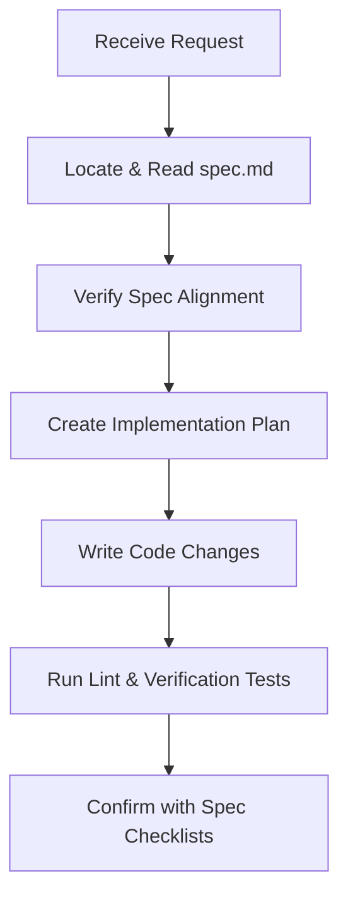

# Spec-Driven Development (SDD) Playbook

This skill instructs the agent on how to execute development tasks using the **Spec-Driven Development** paradigm. Rather than writing ad-hoc code, the agent anchors all architectural and feature modifications strictly to the specification files in the workspace.

---

## 1. The SDD Operational Workflow

When a user requests a new feature, a bug fix, or a structural change, the agent must follow this workflow:

### Step 1: Spec Grounding
* Locate the specification document (usually `spec.md` or `docs/spec.md`) at the root of the workspace.
* Read the specification file in full using the `view_file` tool to load all mathematical models, API schemas, design systems, and business rules.

### Step 2: Implementation Planning
* Before editing any source code, compare the requested change against the specification rules.
* If the user's request introduces an architectural change or a new calculation rule, **update `spec.md` first** to document the new specification, ensuring it remains the single source of truth.
* Draft a detailed implementation plan that lists which components, files, and state variables are affected.

### Step 3: Precise Code Execution
* Implement changes using targeted code edit tools. Ensure that all variable naming, algorithm implementations, and UI styling variables strictly match the exact terms defined in `spec.md`.

### Step 4: Verification & Compliance Check
* Run static checks (e.g. `npm run lint`) and builds (`npm run build`) to ensure the codebase remains healthy.
* Run a manual or automated verification pass testing the exact numbers and yields described in the verification section of `spec.md`.
